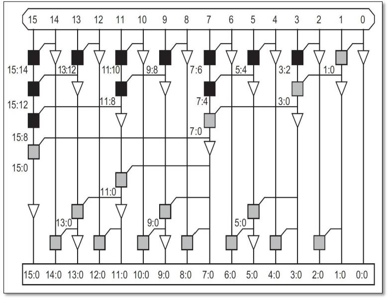

<div id="top"></div>


<br />
<div align="center">
  
  <a href="https://github.com/MNourbakhsh75/vlsi_ca3">
    
  </a>
 

  <h3 align="center">Brent Kung and Kogge Stone Adder</h3>

  <p align="center">
    VLSI Course Assignment - Spring 2019 - University of Tehran
    
</div>


<details>
  <summary>Table of Contents</summary>
  <ol>
    <li>
      <a href="#about-the-project">About The Project</a>
    </li>
    <li>
      <a href="#built-with">Built With</a>
    </li>
    <li><a href="#useful-links">Useful Links</a></li>
    <li><a href="#contact">Contact</a></li>
  </ol>
</details>


<!-- ABOUT THE PROJECT -->
## About The Project

This project is an implementation of 16-bit Kogge Stone and Brent Kung adders. The implementation was done with Verilog.

### Brent Kung
The algorithm calculates the prefix tree for the *last* output. Then creates inverse tree for the obtaining the rest values. This adder is not the fastest, yet it has the lowest wiring tracks and fanout, which decreases area and delay respectively. The implementation can be found in <a href="https://github.com/MNourbakhsh75/vlsi_ca3/blob/master/Brent_Kung%20.v">```Brent_Kung.v```</a>.


### Kogge Stone
Kogge Stone creates prefix tree graph for *each* output. This adder is considered as one of the fastest and largest (in the terms of area) adder. However in the last level, it has large amount of wiring tracks which may decrease the speed. The implementation can be found in <a href="https://github.com/MNourbakhsh75/vlsi_ca3/blob/master/Kogge_Stone.v">```Kogge_Stone.v```</a>.


<a href="https://github.com/IamFlea/AdderCircuitGenerator/tree/master">source</a>

## Built With

The programming language, frameworks, and technologies used in the project are listed here:

* Verilog

<p align="right">(<a href="#top">back to top</a>)</p>


## Useful Links

<a href="https://shareok.org/bitstream/handle/11244/25747/Gundi_okstate_0664M_13905.pdf?sequence=1&isAllowed=y">Implementation of 32-bit Brent Kung Adder</a>

<p align="right">(<a href="#top">back to top</a>)</p>


## Contact

Mehrdad Nourbakhsh - mehrdad.nb4@gmail.com

<p align="right">(<a href="#top">back to top</a>)</p>


